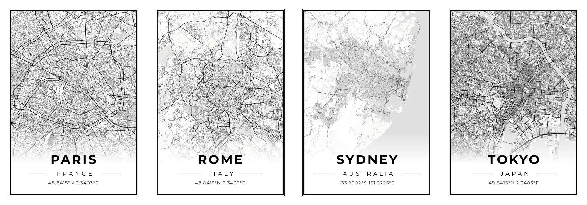

Mapbox2Image
=====



About
----
Generate a high resolution image (poster) of a map with styling from Mapbox.

Requirements
----
* Web browser (known issue with Firefox Zoom CSS rendering not supported)
* Mapbox Access Token (create an account on [Mapbox](https://www.mapbox.com/))

Usage
----
### Webpage
Use the github webpage [here](https://dim4k.github.io/mapbox2image/)

**or**

In a terminal run :
```sh
git clone https://github.com/dim4k/mapbox2image.git
```
Open the `index.html` file in your web browser.

### Add your Mapbox Access Token
Copy / paste your Mapbox access token in the correct field.

### Enjoy
Just target your location with the search and move the map according to your preferences, finally press the download button.
